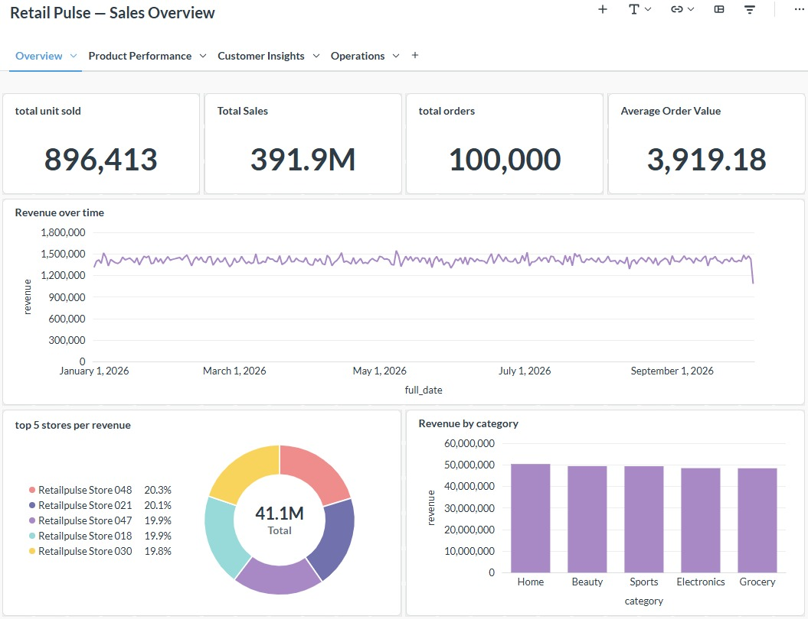
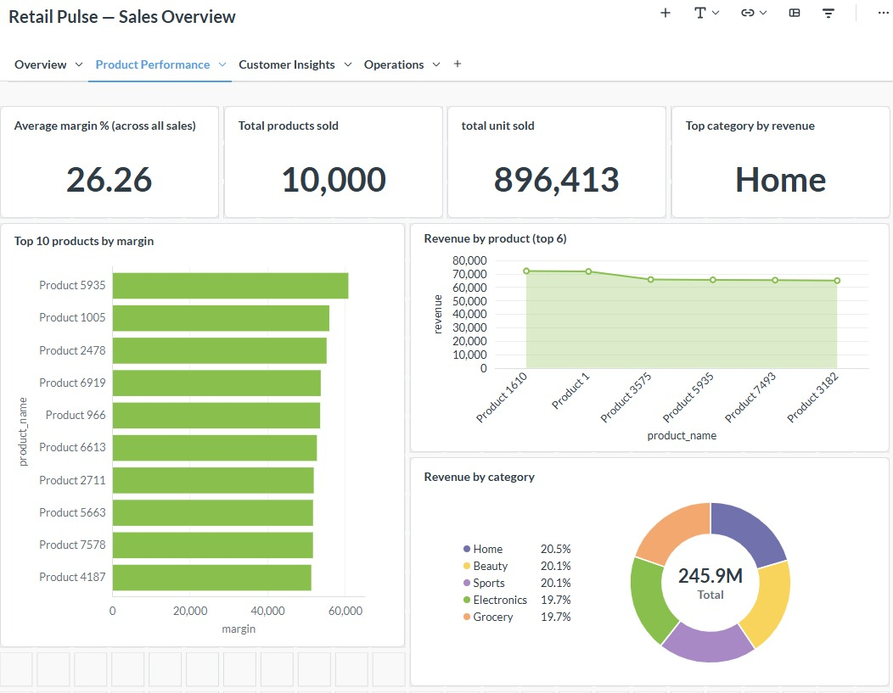
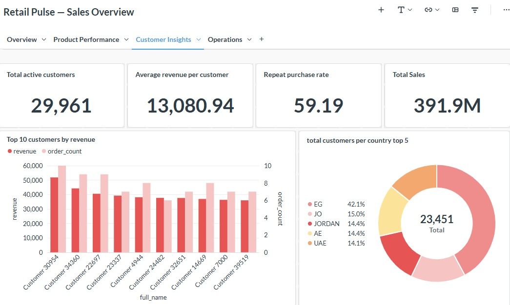
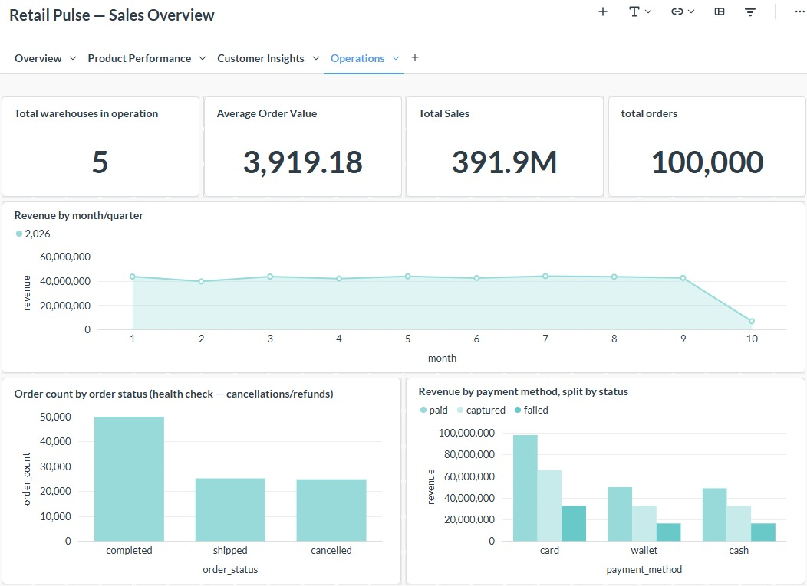

# RetailPulse — End-to-End Big Data Retail Analytics Platform

# Overview

**RetailPulse** is an end-to-end Big Data analytics platform designed to process both **batch and streaming data** for a retail business.

The project integrates multiple Big Data technologies to build a complete data pipeline from source systems to analytical data marts and dashboards.

The platform supports:

* Batch ingestion from PostgreSQL using **Apache Sqoop**
* Streaming ingestion using **Apache Flume → Apache Kafka**
* Stream processing using **Apache Spark Structured Streaming**
* Batch transformations and data cleaning using **Apache Spark**
* Data storage and analytical modeling using **HDFS + Apache Hive**
* SQL querying and validation using **Presto**
* Business dashboards using **Metabase**
* Dimensional modeling using a **Star Schema**
* Slowly Changing Dimensions (**SCD Type 2**) for selected dimensions
* Data quality and reconciliation checks

---

## Table of Contents

- [Overview](#overview)
- [Architecture](#architecture)
- [Data Architecture](#data-architecture)
- [Silver Layer](#silver-layer)
- [Gold Layer](#gold-layer)
- [Data Quality](#data-quality)
- [Technologies](#technologies)
- [Kafka Design](#kafka-design)
- [Streaming Events](#streaming-events)
- [Batch Ingestion](#batch-ingestion)
- [Spark Processing](#spark-processing)
- [Hive Databases](#hive-databases)
- [Analytical Use Cases](#analytical-use-cases)
- [Dashboard](#dashboard)
- [Project Structure](#project-structure)
- [Execution Flow](#execution-flow)
- [Key Engineering Concepts Demonstrated](#key-engineering-concepts-demonstrated)
- [Author](#author)

---

# Architecture

```text
                         ┌──────────────────────┐
                         │   PostgreSQL / RDS   │
                         │                      │
                         │ customers            │
                         │ products             │
                         │ stores               │
                         │ orders               │
                         │ order_items          │
                         │ payments             │
                         │ fulfillment_events   │
                         │ inventory_snapshots  │
                         └──────────┬───────────┘
                                    │
                                  Sqoop
                                    │
                                    ▼
                         ┌──────────────────────┐
                         │     HDFS Bronze      │
                         │      Batch Data      │
                         └──────────┬───────────┘
                                    │
                                    │
                                    ▼
┌──────────────────┐        ┌──────────────────────┐
│ Application      │        │ Spark Batch          │
│ Event Generator  │        │ Transformations      │
└────────┬─────────┘        └──────────┬───────────┘
         │                             │
         ▼                             │
┌──────────────────┐                   │
│ Apache Flume     │                   │
└────────┬─────────┘                   │
         │                             │
         ▼                             │
┌──────────────────┐                   │
│ Apache Kafka     │                   │
│ 3 Partitions     │                   │
└────────┬─────────┘                   │
         │                             │
         ▼                             │
┌──────────────────────────────┐       │
│ Spark Structured Streaming   │       │
└──────────────┬───────────────┘       │
               │                       │
               ▼                       │
       ┌──────────────────┐            │
       │ HDFS Bronze      │            │
       │ Streaming CSV    │            │
       └────────┬─────────┘            │
                │                      │
                └──────────┬───────────┘
                           ▼
                 ┌──────────────────┐
                 │   Silver Layer   │
                 │ Cleaned CSV Data │
                 └────────┬─────────┘
                          │
                          ▼
                 ┌──────────────────┐
                 │    Gold Layer    │
                 │   Star Schema    │
                 └────────┬─────────┘
                          │
                          ▼
                 ┌──────────────────┐
                 │      Hive        │
                 │ Analytical Marts │
                 └────────┬─────────┘
                          │
                    ┌─────┴─────┐
                    ▼           ▼
               ┌─────────┐ ┌──────────┐
               │ Presto  │ │ Metabase │
               └─────────┘ └──────────┘
```

---

# Data Architecture

The platform follows a layered data architecture:

```text
Source
  │
  ▼
Bronze
  │
  ▼
Silver
  │
  ▼
Gold
  │
  ▼
Analytics
```

### Bronze

The Bronze layer stores data as received from the source systems with minimal transformations.

#### Batch Bronze

PostgreSQL tables are ingested using Sqoop into HDFS:

```text
/data/retailpulse/bronze/postgres/
```

Tables:

* customers
* products
* stores
* orders
* order_items
* payments
* fulfillment_events
* inventory_snapshots

#### Streaming Bronze

Application events are generated as newline-delimited JSON and passed through:

```text
Event Generator
      ↓
Flume
      ↓
Kafka
      ↓
Spark Structured Streaming
      ↓
HDFS
```

Streaming Bronze path:

```text
/data/retailpulse/bronze/streaming/events_csv
```

---

# Silver Layer

The Silver layer contains cleaned and standardized data.

Cleaning includes:

* Data type standardization
* Null handling
* Duplicate handling
* Invalid value detection
* Negative value handling
* String normalization
* Country code standardization
* Email normalization
* Status standardization
* Business rule validation
* Primary-key validation

Examples of standardization include:

```text
Egypt → EG
egypt → EG
EG → EG
```

and:

```text
Compeleted → completed
```

depending on the source values and business rules.

Silver data is stored as CSV on HDFS:

```text
/data/retailpulse/silver/
```

Hive database:

```text
retailpulse_silver
```

---

# Gold Layer

The Gold layer implements a **Star Schema** for analytical workloads.

HDFS path:

```text
/data/retailpulse/gold/
```

Hive database:

```text
retailpulse_gold
```

## Dimensions

### dim_date

Calendar dimension containing:

* date_key
* full_date
* year
* quarter
* month
* day
* day_name
* is_weekend

The calendar covers the order timestamp range with an additional date buffer.

---

### dim_customer

Customer dimension implementing **SCD Type 2**.

Tracked attributes:

* full_name
* email
* country_code

Additional attributes:

* customer_key
* customer_id
* signup_date
* scd_valid_from
* scd_valid_to
* is_current

Window functions such as `LAG` and `LEAD` are used to identify customer history.

---

### dim_product

Product dimension implementing **SCD Type 2**.

Tracked attributes:

* product_name
* category
* unit_cost
* list_price

Additional attributes:

* product_key
* product_id
* scd_valid_from
* scd_valid_to
* is_current

---

### dim_store

Store dimension using **Type 1** modeling.

Attributes:

* store_key
* store_id
* store_name
* city
* country_code
* opened_at

---

### dim_payment_method

Contains the distinct combination of:

```text
payment_method
payment_status
```

The latest payment record for each order is identified using a `ROW_NUMBER()` window function.

---

### dim_order_status

Contains the standardized order statuses used by the fact table.

Examples:

```text
completed
cancelled
shipped
```

---

### dim_fulfillment_status

Contains the latest fulfillment state derived from fulfillment events.

Attributes:

* fulfillment_status_key
* latest_event_type
* warehouse_code

---

# Fact Table

## fact_sales

The central fact table represents sales at the:

> **Order Item Grain**

This means:

```text
One row = One order item
```

Main columns include:

* sales_key
* date_key
* customer_key
* product_key
* store_key
* payment_method_key
* order_status_key
* fulfillment_status_key
* order_id
* order_item_id
* quantity
* unit_price
* line_discount
* line_amount
* order_discount_allocated
* payment_amount_allocated
* unit_cost
* margin_amount

### Revenue Calculation

```text
line_amount =
quantity × unit_price - line_discount
```

### Margin Calculation

```text
margin_amount =
line_amount - (unit_cost × quantity)
```

Order-level discounts and payment amounts are allocated proportionally to order items based on their contribution to the order.

---

# Data Quality

The project includes data quality checks across the analytical model.

Checks include:

* Row counts
* Null checks
* Primary-key uniqueness
* Foreign-key null checks
* Duplicate fact grain detection
* Invalid numeric values
* Referential integrity
* Revenue reconciliation

The fact table grain is validated using:

```text
order_item_id
```

to ensure that each order item appears only once.

---

# Technologies

| Technology              | Purpose                                   |
| ----------------------- | ----------------------------------------- |
| Apache Sqoop            | Batch ingestion from PostgreSQL           |
| Apache Flume            | Streaming event ingestion                 |
| Apache Kafka            | Distributed event streaming               |
| Apache Spark            | Batch processing and Structured Streaming |
| HDFS                    | Distributed storage                       |
| Apache Hive             | Data warehouse and analytical tables      |
| Presto                  | SQL analytics and validation              |
| Metabase                | Business intelligence and dashboards      |
| PostgreSQL / Amazon RDS | Source relational database                |
| Docker                  | Local Big Data environment                |
| Python                  | Event generation and Spark development    |

---

# Kafka Design

Streaming events are published to:

```text
retailpulse-events
```

The topic uses:

```text
3 partitions
```

The partitioned architecture allows events to be distributed across Kafka partitions before being consumed by Spark Structured Streaming.

---

# Streaming Events

The event generator produces events such as:

```text
product_viewed
cart_updated
checkout_started
order_confirmed
fulfillment_update
```

Each event contains fields such as:

```text
event_id
event_type
event_timestamp
customer_id
session_id
order_id
product_id
store_id
channel
sequence
```

The generator also simulates real-world data quality problems including:

* Malformed JSON
* Duplicate events
* Late events

This allows the streaming pipeline to be tested under non-ideal conditions.

---

# Batch Ingestion

PostgreSQL source tables are imported into HDFS using Sqoop.

Different tables use appropriate mapper configurations and split columns according to their primary keys.

Examples:

```text
orders          → order_id
order_items     → order_item_id
payments        → payment_id
customers       → customer_id
products        → product_id
```

The imported data is then registered in the Hive Bronze layer.

---

# Spark Processing

Apache Spark is used for both batch and streaming workloads.

### Batch Processing

Spark is responsible for:

```text
Bronze
  ↓
Cleaning
  ↓
Standardization
  ↓
Validation
  ↓
Silver
  ↓
Dimensional Modeling
  ↓
Gold
```

### Streaming Processing

```text
Kafka
  ↓
Spark Structured Streaming
  ↓
CSV
  ↓
HDFS Bronze
```

Checkpointing is used to maintain streaming progress.

---

# Hive Databases

The project uses separate databases for each processing layer:

```text
retailpulse_bronze
retailpulse_silver
retailpulse_gold
```

This separation makes the pipeline easier to understand, maintain, and query.

---

# Analytical Use Cases

The Gold layer supports analytical use cases such as:

### Sales Performance

* Daily revenue
* Daily orders
* Average Order Value
* Units sold
* Revenue by store
* Revenue by product category

### Customer Analytics

* Customer purchase activity
* Customer geography
* Customer order history

### Product Analytics

* Product sales
* Category performance
* Product margins

### Fulfillment Analytics

* Order lifecycle
* Fulfillment events
* Warehouse activity
* SLA-related analysis

### Inventory Analytics

* Stock levels
* Low inventory detection
* Product/store inventory analysis

### Digital Funnel

Streaming events can support analysis of:

```text
Product Viewed
      ↓
Cart Updated
      ↓
Checkout Started
      ↓
Order Confirmed
```

---

# Dashboard

Business dashboards are built in **Metabase**, connected to the Gold layer (`retailpulse_gold`) through **Presto**.

The **Retail Pulse — Sales Overview** dashboard is organized into four tabs:

| Tab | Focus |
| --- | --- |
| Overview | Company-wide sales KPIs and trends |
| Product Performance | Margins, top products, and category mix |
| Customer Insights | Customer value, retention, and geography |
| Operations | Order health, payments, and monthly revenue |

## 1. Overview



**KPIs:** Total Units Sold (896,413), Total Sales (391.9M), Total Orders (100,000), Average Order Value (3,919.18).

**Visuals:**

* **Revenue over time** — daily revenue trend from January to October 2026
* **Top 5 stores by revenue** — revenue share of the best-performing stores
* **Revenue by category** — Home, Beauty, Sports, Electronics, and Grocery

## 2. Product Performance



**KPIs:** Average Margin % (26.26), Total Products Sold (10,000), Total Units Sold (896,413), Top Category by Revenue (Home).

**Visuals:**

* **Top 10 products by margin** — horizontal bar chart
* **Revenue by product (top 6)** — area chart of the best-selling products
* **Revenue by category** — donut chart showing each category's share of revenue

## 3. Customer Insights



**KPIs:** Total Active Customers (29,961), Average Revenue per Customer (13,080.94), Repeat Purchase Rate (59.19), Total Sales (391.9M).

**Visuals:**

* **Top 10 customers by revenue** — revenue and order count per customer
* **Total customers per country (top 5)** — customer distribution by country

## 4. Operations



**KPIs:** Total Warehouses in Operation (5), Average Order Value (3,919.18), Total Sales (391.9M), Total Orders (100,000).

**Visuals:**

* **Revenue by month/quarter** — monthly revenue trend for 2026
* **Order count by order status** — completed, shipped, and cancelled orders (order health check)
* **Revenue by payment method, split by status** — card, wallet, and cash, broken down by payment status

---

# Project Structure

```text
Capstone_RetailPulse/
│
├── README.md
├── .gitignore
│
├── notebooks/
│   ├── silver/
│   └── gold/
│
├── streaming/
│   └── generate_retailpulse_events.py
│
├── flume/
│   └── flume.conf
│
├── spark/
│   └── ...
│
├── hive/
│   └── ...
│
├── sql/
│   └── ...
│
└── docs/
    ├── architecture.png
    └── dashboard/
        ├── 01_overview.jpeg
        ├── 02_product_performance.jpeg
        ├── 03_customer_insights.jpeg
        └── 04_operations.jpeg
```

> The exact structure may vary depending on the execution environment.

---

# Execution Flow

## 1. Batch Pipeline

```text
PostgreSQL
    ↓
Sqoop
    ↓
HDFS Bronze
    ↓
Hive Bronze
    ↓
Spark
    ↓
Silver
    ↓
Gold Star Schema
```

## 2. Streaming Pipeline

```text
Event Generator
    ↓
Flume
    ↓
Kafka
    ↓
Spark Structured Streaming
    ↓
HDFS Bronze
    ↓
Hive
```

## 3. Analytics

```text
Gold Hive Tables
       ↓
   ┌───┴────┐
   ↓        ↓
 Presto   Metabase
```

---

# Key Engineering Concepts Demonstrated

This project demonstrates practical experience with:

* Batch vs Streaming Processing
* Distributed Data Ingestion
* HDFS Storage
* Kafka Topics and Partitions
* Kafka Consumer Processing
* Flume Taildir Source
* Spark Structured Streaming
* Spark DataFrame API
* Window Functions
* Data Cleaning
* Data Validation
* CSV-based Data Lakes
* Hive External Tables
* Star Schema
* Surrogate Keys
* SCD Type 1
* SCD Type 2
* Fact Table Grain
* Dimension Modeling
* Incremental/Streaming Processing
* Checkpointing
* Data Quality
* Data Reconciliation
* SQL Analytics

---

# Important Note

This project is a **learning and portfolio capstone** designed to simulate a production-style Big Data platform.

The data, infrastructure, and workloads are simulated for educational purposes and should not be interpreted as a production retail system.

Credentials, private configuration, generated data, Kafka checkpoints, and environment-specific files are intentionally excluded from the repository.

---

# Author

**Moamen Samir** — [github.com/kxmaie](https://github.com/kxmaie)

**Khaled Waleed** — [github.com/Khaled-3](https://github.com/Khaled-3)

Aspiring Data Engineers focused on:

* Data Engineering
* Big Data
* Apache Spark
* Apache Kafka
* Apache Hive
* Data Warehousing
* Cloud Data Platforms
